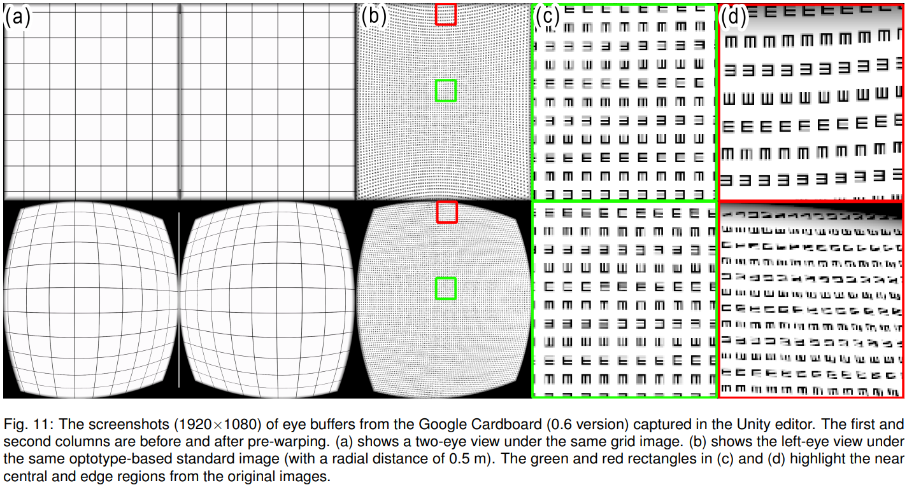

# Omnidirectional Virtual Visual Acuity (OVVA): 
### A User-centric Visual Clarity Metric for Virtual Reality Head-mounted Displays and Environments
IEEE VR 2024 (TVCG journal track) paper
### [Paper](https://ieeexplore.ieee.org/document/10458404) | [Youtube Video](https://www.youtube.com/watch?v=nSSgNcdocbo) | [B站视频](https://www.bilibili.com/video/BV1xi421d7rt/)

### [Introduction of Visual Clarity in VR](https://chaosikaros.github.io/blog/OVVA_Video_EN/) | [VR视觉清晰度的介绍](https://chaosikaros.github.io/blog/OVVA_Video_CN/)

## Overview


<p float="left">
  
   
</p>


Users' perceived image quality of virtual reality head-mounted displays (VR HMDs) is determined by multiple factors, including the HMD's structure, optical system, display and render resolution, and users' visual acuity (VA). Existing metrics such as pixels per degree (PPD) have limitations that prevent accurate comparison of different VR HMDs. One of the main limitations is that not all VR HMD manufacturers released the official PPD or details of their HMDs' optical systems. Without these details, developers and users cannot know the precise PPD or calculate it for a given HMD. The other issue is that the visual clarity varies with the VR environment. 

Our work has identified a gap in having a feasible metric that can measure the visual clarity of VR HMDs. To address this gap, we present an end-to-end and user-centric visual clarity metric, omnidirectional virtual visual acuity (OVVA), for VR HMDs. OVVA extends the physical visual acuity chart into a virtual format to measure the virtual visual acuity of an HMD's central focal area and its degradation in its noncentral area. OVVA provides a new perspective to measure visual clarity and can serve as an intuitive and accurate reference for VR applications sensitive to visual accuracy. Our results show that OVVA is a simple yet effective metric for comparing VR HMDs and environments.

## Key Features


## Installation & Set-up

The sample project is built using Unity 2021.3.17f1.
You can open the sample project directly or import the Unity package.

### Dependencies: 
- OpenXR Plugin
- TextMeshPro

### Steps:
1. Install the above Unity package dependencies.
2. Import the Unity package of OVVA.

## OVVA Test Procedure

1. Adjust your HMD to the most comfortable position that allow you to see letter clearly.
2. The recognition task generates all 8 E letters on a ring first. You can start it by click on the Confirm button. When the test starts, all E letters will disappear and show up one by one randomly. Please indicate the orientation of the current E letter using directional buttons. In the first stage for CVVA measurement, be careful and do not make mistake, it is sensitive to mistakes.
3. In the second stage for CVVA degradation measurement, the test can be end if any letters on the ring fall outside your field of vision. The ring should display 8 letters in total.
4. Upon completion, you will receive an image for the interpretation of CVVA and its degradation. You can also find this image and raw OVVA data recording in “OVVA\OVVA\_Data\OVVADataset”.


## Getting Started

The example scenes are located in the Examples folder. It is recommended to build them and run instead of running in the Unity editor.

### OBSI

Scene: OBSI VR.unity

We introduce optotype-based standard images (OBSI) to reveal and highlight the key software factors that cause the non-uniform distribution of image quality in VR environments.




### OVVA Test with Keyboard  (available demo: "OVVA.Windows.exe.zip" in release page)

Scene: OVVA VR.unity

This is a remake version of OVVA test used in experiment. It contains tips UI with buttons for in-app instruction.
```
Attention: This is a VR application based on OpenXR, it should be run as a PC VR application.
```
Input: 
- Directional buttons = Arrow keys
- Confirm button = Space

### OVVA Analysis Example

Scene: OVVA Analysis.unity

This scene is an example of batch processing for multiple raw OVVA data recordings.


<p float="left">
  
   
  
</p>

### Known issues

1. In the first stage for CVVA measurement, if users clicked on wrong directional button for letter with recognizable orientation, they need to restart the task. The radial distance of the ring's center is adjusted using the bisection method in this stage. This is an approximation method used to find the roots of an equation by repeatedly dividing the interval. Correct answers increase the radial distance, while incorrect ones decrease it. Therefore, the first stage requires a 100% recognition rate to ensure the correct bisection method steps.

## Future Work

1. Improve the in-app instruction.
2. Enhance the rendering quality of optotype.
3. Boost performance of OBSI generator and OVVA heatmap generator.
4. Develop an online database for collection of public OVVA data.
5. Create a VR HMD name database for the filing system of OVVA database.
6. Change the recording file format from CSV to JSON.
7. Improve the OVVA test procedure by involving Bayesian methods to increase the level of fault tolerance.
8. Add input device support of VR controller by Unity's XR Interaction Toolkit (XRI).

## Contributions

We welcome community contributions to this repository.

## Citations
```bibtex
@ARTICLE{10458404,
  author={Wang, Jialin and Shi, Rongkai and Li, Xiaodong and Wei, Yushi and Liang, Hai-Ning},
  journal={IEEE Transactions on Visualization and Computer Graphics}, 
  title={Omnidirectional Virtual Visual Acuity: A User-centric Visual Clarity Metric for Virtual Reality Head-mounted Displays and Environments}, 
  year={2024},
  volume={},
  number={},
  pages={1-11},
  keywords={Visualization;Measurement;Resists;Rendering (computer graphics);Optical imaging;Image resolution;Optical sensors;Virtual reality;Head-mounted displays;Measurements;Visual clarity;Passthrough;Render resolution;Frame rate},
  doi={10.1109/TVCG.2024.3372127}}
```

Link to [Paper](https://ieeexplore.ieee.org/document/10458404)

Contact: chaosikaros@outlook.com
